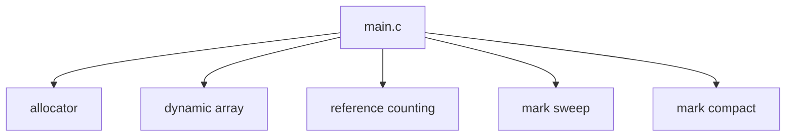
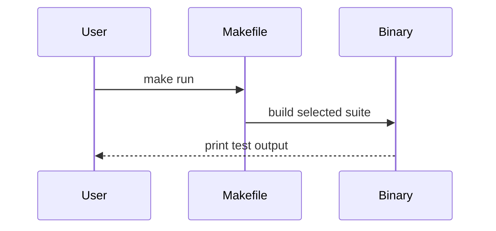

# Building-GCs-and-Dynamic-Array-Over-Custom-C-Allocator

Production-oriented C implementations of a custom memory allocator, a generic dynamic array, and three garbage collection strategies built on top of the same low-level substrate:

1. Reference Counting with cascading release.
2. Mark-Sweep with root-set traversal and pointer tagging.
3. Mark-Compact with bump allocation, forwarding addresses, and heap compaction.

The repository is intentionally modular. The allocator and dynamic array are shared infrastructure, while each garbage collector is compiled into its own executable via the Makefile suite. That separation keeps the control flow easy to reason about and makes each GC strategy independently demonstrable.

## Architecture At A Glance

```txt
                    +----------------+
                    |    main.c      |
                    +----------------+
                   /   |    |    |    \
                  /    |    |    |     \
                 v     v    v    v      v
           allocator  array   RC   mark-sweep  mark-compact

allocator      -> word-aligned heap blocks
dynamic array  -> circular buffer semantics
reference cnt  -> retain / release ownership
mark-sweep     -> root stack + mark / sweep
mark-compact   -> bump allocation + compaction
```

The same custom allocator backs every module. That choice keeps all allocations visible, controlled, and testable, which is essential when evaluating GC behavior from first principles.



## Complexity At A Glance

| Subsystem                    | Typical Cost                       | Notes                             |
| ---------------------------- | ---------------------------------- | --------------------------------- |
| Allocator allocation         | $O(n)$ scan                      | First-fit free-list search.       |
| Allocator free               | $O(n)$                           | Coalescing may walk the list.     |
| Dynamic array push / enqueue | Amortized $O(1)$                  | Resize is occasional.             |
| Dynamic array pop / dequeue  | $O(1)$                           | No shifting.                      |
| Reference counting release   | $O(1)$ typical, $O(n)$ cascade | Depends on graph depth.           |
| Mark-sweep GC                | $O(R + N)$                       | Roots plus all allocated objects. |
| Mark-compact GC              | $O(R + N)$                       | Additional relocation passes.     |

## Repository Layout

```txt
Building-GCs-and-Dynamic-Array-Over-Custom-C-Allocator
 ┣ allocator
 ┃ ┣ README.md
 ┃ ┣ allocator.c
 ┃ ┗ allocator.h
 ┣ dynamic_array
 ┃ ┣ README.md
 ┃ ┣ dynamic_array.c
 ┃ ┗ dynamic_array.h
 ┣ mark_and_compact
 ┃ ┣ README.md
 ┃ ┣ mark_and_compact.c
 ┃ ┗ mark_and_compact.h
 ┣ mark_and_sweep
 ┃ ┣ README.md
 ┃ ┣ mark_and_sweep.c
 ┃ ┗ mark_and_sweep.h
 ┣ reference_counting
 ┃ ┣ README.md
 ┃ ┣ reference_counting.c
 ┃ ┗ reference_counting.h
 ┣ .gitignore
 ┣ Makefile
 ┣ README.md
 ┗ main.c
```

| Path                                      | Purpose                                                                    |
| ----------------------------------------- | -------------------------------------------------------------------------- |
| [allocator/](allocator/)                   | Custom heap manager, free list, block splitting, and coalescing.           |
| [dynamic_array/](dynamic_array/)           | Generic pointer array with amortized growth and circular queue operations. |
| [reference_counting/](reference_counting/) | Reference-counted object graph with cascading releases.                    |
| [mark_and_sweep/](mark_and_sweep/)         | Stop-the-world mark-sweep collector using a root stack.                    |
| [mark_and_compact/](mark_and_compact/)     | Stop-the-world mark-compact collector with forwarding and heap compaction. |
| [main.c](main.c)                           | Test harness that exercises the allocator, array, and selected GC suite.   |
| [Makefile](Makefile)                       | Build and run entry points for`rc`, `sweep`, `compact`, and `all`. |

## Core Design Decisions

### Custom Memory Allocator Architecture

The allocator in [allocator/allocator.c](allocator/allocator.c) provides a fixed-size heap backed by `mmap`, then manages that arena with a singly linked free list of `BlockHeader` nodes. Each block stores:

| Field       | Role                                             |
| ----------- | ------------------------------------------------ |
| `next`    | Links adjacent blocks in heap order.             |
| `size`    | Payload size in bytes, excluding the header.     |
| `is_free` | Tracks whether the block is available for reuse. |

Allocation is a first-fit walk over the free list. When a free block is larger than needed, it is split so the unused tail remains reusable instead of becoming dead space. Freeing a block marks it free and then coalesces adjacent free neighbors, which reduces external fragmentation and keeps the free list healthy over time.

The allocator also rounds payload sizes using the `ALIGN` macro so returned addresses stay word-aligned. That matters for two reasons:

1. It preserves safe access for native types on typical 64-bit platforms.
2. It avoids wasting allocator metadata on misaligned small requests.

```txt
Allocation flow

request -> align -> search free list -> split if needed -> return payload
                    |
                    +-> if block too small, continue scanning
```

```txt
Allocator block layout

┌───────────────────────────────┐
│ BlockHeader                   │
│ next    -> next block         │
│ size    -> payload bytes      │
│ is_free -> available?         │
├───────────────────────────────┤
│ User payload                  │
│ aligned to word boundary      │
└───────────────────────────────┘
```

### Struct Padding and Alignment

Low-level memory layout is not an implementation detail here; it is part of the performance model.

The allocator header and GC object layouts are deliberately compact, with payloads stored in unions so only one representation lives at a time. This design minimizes per-object overhead in two ways:

1. Shared payload storage keeps mutually exclusive fields from multiplying object size.
2. Word alignment ensures the allocator and GC can move blocks safely without introducing undefined behavior.

The allocator additionally aligns block sizes and keeps the heap organized as contiguous header-plus-payload regions. That avoids hidden padding at the allocation boundary and makes block splitting and compaction predictable.

### Dynamic Array as a Resizable Circular Buffer

The data structure in [dynamic_array/dynamic_array.c](dynamic_array/dynamic_array.c) is more than a growable array. It is also a circular buffer with `head`, `count`, and `capacity` bookkeeping.

That gives the structure two useful modes:

1. Stack-like use through `array_push` and `array_pop`.
2. Queue-like use through `array_enqueue` and `array_dequeue`.

The key engineering choice is that dequeueing never shifts the physical contents of the array. Instead, the `head` index advances modulo `capacity`, which keeps removal from the front at $O(1)$ time. When the backing array fills up, it grows by a factor of two and re-linearizes the logical order into a fresh contiguous buffer. That gives amortized $O(1)$ insertion with predictable cache behavior.

```txt
Circular buffer view

physical storage: [0][1][2][3][4][5]
logical order:        H  A  B  C

actual index = (head + logical_index) % capacity
```

### Garbage Collection Model

The repository demonstrates three distinct policies on top of the same object model:

| Strategy           | Strength                                              | Main Tradeoff                                        |
| ------------------ | ----------------------------------------------------- | ---------------------------------------------------- |
| Reference Counting | Immediate reclamation for acyclic graphs.             | Cannot reclaim cycles without extra cycle detection. |
| Mark-Sweep         | Reclaims unreachable objects across arbitrary graphs. | Leaves heap fragmentation behind.                    |
| Mark-Compact       | Reclaims unreachable objects and compacts live data.  | Requires object relocation and pointer updates.      |

The GC implementations all use a root set stored in the shared dynamic array. That keeps the demonstration consistent: only the collection strategy changes, not the root management surface.

## Algorithm Deep Dives

### Reference Counting

The reference-counting collector in [reference_counting/reference_counting.c](reference_counting/reference_counting.c) models three object types:

| Type         | Payload                                        |
| ------------ | ---------------------------------------------- |
| `OBJ_INT`  | Integer value.                                 |
| `OBJ_CHAR` | Character value.                               |
| `OBJ_PAIR` | Two object references (`head` and `tail`). |

Each object starts with `ref_count = 1`. Creating a pair retains both children so the pair owns its edges. Releasing a pair decrements the pair’s own count, and when it reaches zero it recursively releases its `head` and `tail`. This cascading release is the essential behavior: ownership walks down the object graph automatically, so acyclic structures disappear as soon as the last external reference is removed.

```txt
Reference counting life cycle

create object
	 |
	 v
  ref_count = 1
	 |
 retain() -> ref_count++
	 |
 release() -> ref_count--
	 |
	 +-- if ref_count > 0, keep alive
	 |
	 +-- if ref_count == 0, free object
```

The model is intentionally simple and deterministic, which makes it excellent for understanding ownership transfer. Its known limitation is cycle retention; strongly connected objects can keep each other alive even when the outside world no longer references them.

### Mark-Sweep

The mark-sweep collector in [mark_and_sweep/mark_and_sweep.c](mark_and_sweep/mark_and_sweep.c) builds a `VM` around two stateful ideas:

1. A root stack implemented as the shared dynamic array.
2. A linked list of all allocated objects rooted at `first_object`.

Reachability is encoded with pointer tagging. The low bit of the `next` pointer acts as a mark bit, so the collector can annotate an object without adding a separate field. The mark phase starts from the root stack, walks pair relationships transitively, and sets the mark bit on every reachable object. The sweep phase then walks the global object list and frees anything that was not marked.

```txt
Mark-sweep memory picture

Roots:      [R1] [R2]
			 |     |
			 v     v
Heap list:  [A] -> [B] -> [C] -> [D]

After mark:
			[A*] -> [B*] -> [C ] -> [D*]

Sweep:
   free unmarked objects, keep marked ones
```

```txt
Mark-sweep flow

roots -> mark reachable objects -> sweep unreachable objects -> clear marks
```

The result is a classic stop-the-world collector with straightforward semantics:

```txt
Mark-sweep execution trace

VM
  |
  +--> enumerate root pointers
  +--> mark reachable objects
  +--> sweep unreachable objects
```

This strategy is easy to audit and highly effective for teaching and instrumentation. Its main cost is fragmentation: freed objects are returned to the allocator, but the object graph itself is not compacted.

### Mark-Compact

The mark-compact collector in [mark_and_compact/mark_and_compact.c](mark_and_compact/mark_and_compact.c) uses a different heap model: objects are allocated linearly from `heap_start` using `next_free`, which is a bump pointer. That makes allocation extremely fast until the arena fills.

Collection proceeds in four phases:

1. Mark reachable objects from the root stack using pointer tagging.
2. Compute forwarding addresses for all live objects.
3. Update roots and in-heap pointers to the new object locations.
4. Compact the heap by memmoving live objects into a dense prefix of the arena.

```txt
Mark-compact memory picture

Before GC:
heap_start
	|
	v
[A] [garbage] [B] [garbage] [C] ........ next_free

After mark:
[A*] [      ] [B*] [      ] [C*]

After compaction:
heap_start
	|
	v
[A] [B] [C] ........ next_free
```

```txt
Mark-compact movement trace

roots -> trace live objects -> compute forwarding addresses -> rewrite pointers -> memmove live objects forward
```

This architecture eliminates fragmentation because all live objects end up packed at the front of the heap. It also demonstrates the core relocation problem in compacting collectors: once objects move, every pointer to them must be rewritten to the new address.

```txt
Mark-compact flow

roots -> mark live objects -> compute forwarding addresses -> update pointers -> compact heap
```

The design is intentionally explicit. The implementation shows why compacting collectors need a forwarding step and why pointer updates must happen before the final physical move is considered complete.

## Build And Run

### Download The Repository

```bash
git clone https://github.com/abdelhalimyasser/Building-GCs-and-Dynamic-Array-Over-Custom-C-Allocator.git
cd Building-GCs-and-Dynamic-Array-Over-Custom-C-Allocator
```

### Build And Execute

The provided Makefile exposes three build targets and one combined run mode.

```bash
make clean
make
make run
```

`make` builds all executables. `make run` defaults to running the full suite sequentially. To run an individual collector, choose the `SUITE` variable explicitly.

| Command                    | Meaning                                                       |
| -------------------------- | ------------------------------------------------------------- |
| `make`                   | Build`gc_app_rc`, `gc_app_sweep`, and `gc_app_compact`. |
| `make run`               | Build and run all active suites in sequence.                  |
| `make run SUITE=rc`      | Build and run the reference-counting executable.              |
| `make run SUITE=sweep`   | Build and run the mark-sweep executable.                      |
| `make run SUITE=compact` | Build and run the mark-compact executable.                    |
| `make run SUITE=all`     | Build and run all three executables sequentially.             |
| `make clean`             | Remove generated binaries.                                    |

If you want to rebuild and run a single suite end to end, use one of the following:

```bash
make clean && make run SUITE=rc
make clean && make run SUITE=sweep
make clean && make run SUITE=compact
```

The suite selection is compile-time driven through the macros defined in [main.c](main.c). Each executable links the common allocator and dynamic array modules, then links exactly one GC implementation.



## What The Test Harness Demonstrates

The harness in [main.c](main.c) always exercises the dynamic array first, then executes the selected GC test.

| Test               | Demonstrates                                                              |
| ------------------ | ------------------------------------------------------------------------- |
| Dynamic array      | Custom allocator integration, append/remove, and circular queue behavior. |
| Reference counting | Increment, retain, and cascading release semantics.                       |
| Mark-sweep         | Root handling, reachability marking, and sweeping unreachable nodes.      |
| Mark-compact       | Bump allocation, forwarding, pointer rewriting, and heap compaction.      |

## Additional Module Readmes

Each subdirectory contains a dedicated technical README for that module:

| Module             | README                                                      |
| ------------------ | ----------------------------------------------------------- |
| Allocator          | [allocator/README.md](allocator/README.md)                   |
| Dynamic array      | [dynamic_array/README.md](dynamic_array/README.md)           |
| Reference counting | [reference_counting/README.md](reference_counting/README.md) |
| Mark-sweep         | [mark_and_sweep/README.md](mark_and_sweep/README.md)         |
| Mark-compact       | [mark_and_compact/README.md](mark_and_compact/README.md)     |

Each of those documents focuses on the local API surface, memory model, and algorithmic decisions for the corresponding subsystem.
