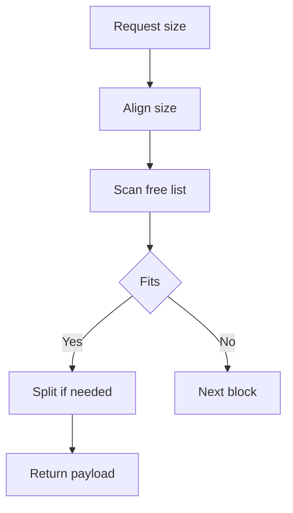

# Allocator

This module implements the memory substrate for the entire repository. Every other subsystem allocates through this allocator, so its behavior defines the baseline for alignment, fragmentation, and reuse.

## Responsibilities

The allocator provides a fixed-size heap managed through a linked free list. It supports initialization, allocation, release, and resize operations without delegating to the system allocator after startup.

| API | Role |
| --- | --- |
| `mem_init()` | Map and initialize the heap arena. |
| `mem_malloc(size_t size)` | Find a free block, split if needed, and return a payload pointer. |
| `mem_free(void *ptr)` | Mark a block free and coalesce adjacent free blocks. |
| `mem_realloc(void *ptr, size_t new_size)` | Resize in place when possible, otherwise allocate-copy-free. |

## Complexity Summary

| API | Time Complexity | Notes |
| --- | --- | --- |
| `mem_init()` | $O(1)$ | One-time heap setup. |
| `mem_malloc(size_t)` | $O(n)$ | First-fit scan over the free list. |
| `mem_free(void *)` | $O(n)$ | Coalescing may inspect adjacent blocks. |
| `mem_realloc(void *, size_t)` | $O(n)$ | May allocate, copy, and free. |

## Memory Layout

Each heap block is represented by a `BlockHeader` immediately followed by the user payload.

```txt
Memory block layout

[ BlockHeader ][ Payload bytes................................ ]
      |
      +-- next pointer to the following block
      +-- payload size
      +-- free / busy flag
```

The header stores the next block pointer, the payload size, and a free flag. Because the header itself is word-aligned and the payload size is rounded up with `ALIGN`, returned pointers remain naturally aligned for native types.

```txt
Heap block structure

┌───────────────────────────────┐
│ BlockHeader                   │
│ next    -> next block         │
│ size    -> payload bytes      │
│ is_free -> 1 or 0             │
├───────────────────────────────┤
│ payload bytes                 │
└───────────────────────────────┘
```

### Why The Header Is Compact

The allocator keeps its metadata small on purpose:

1. `size_t` and pointer fields match the architecture word size, so they are efficient to access.
2. The `bool` flag adds only a tiny amount of state to each block.
3. The `ALIGN(sizeof(BlockHeader))` rule ensures the header-to-payload boundary respects word alignment.

That means each allocation pays only the metadata cost needed to manage reuse, rather than carrying unnecessary per-block overhead.

## Allocation Strategy

`mem_malloc` uses a first-fit search over the free list.

1. Walk the free list in address order.
2. Select the first free block large enough for the aligned request.
3. Split the block if the remainder can hold another header plus usable payload.
4. Mark the selected block busy and return the payload address.

```txt
Allocation scan

free_list -> block1 -> block2 -> block3 -> ...
              |
              +--> fits? yes -> split if needed -> return payload
              +--> fits? no  -> continue scanning
```

This strategy is simple, fast, and predictable. It trades some theoretical optimality for low implementation overhead and easy debugging.



## Splitting And Coalescing

The allocator actively fights fragmentation in both directions:

| Operation | Effect |
| --- | --- |
| Split | Prevents large blocks from being wasted on smaller requests. |
| Coalesce | Merges adjacent free blocks to recover larger contiguous spans. |

Splitting matters because it keeps the tail of an oversized block available for later use. Coalescing matters because freed blocks are only useful if the allocator can reconstruct enough contiguous space for the next large request.

```txt
Before split
┌────────────── large free block ──────────────┐

After split
┌──── allocated ────┐┌──── remainder free ────┐

Before coalesce
┌── free ──┐┌── free ──┐

After coalesce
┌──────────── merged free block ───────────────┐
```

```txt
Fragmentation control

split:
[ large free block ] -> [ allocated ][ remainder free ]

coalesce:
[ free ][ free ] -> [ merged free block ]
```

## Resize Behavior

`mem_realloc` follows the conventional contract:

1. If `ptr == NULL`, it behaves like `mem_malloc(new_size)`.
2. If `new_size == 0`, it behaves like `mem_free(ptr)`.
3. If the existing block is already large enough, the current pointer is reused.
4. Otherwise, a new block is allocated, the old contents are copied, and the original block is freed.

```txt
Realloc flow

ptr == NULL   -> mem_malloc(new_size)
new_size == 0 -> mem_free(ptr)
fits in place -> reuse current block
otherwise     -> allocate new, copy old, free old
```

That gives the module a clean, portable contract without requiring callers to understand the free list implementation.

## Engineering Notes

The allocator deliberately operates on a fixed heap size defined by `HEAP_SIZE`. That constraint keeps allocator behavior deterministic and makes fragmentation visible during testing. It is well suited to studying memory management techniques because every allocation decision has a measurable effect on the same finite arena.

## Related Documentation

- [Root overview](../README.md)
- [Dynamic array](../dynamic_array/README.md)