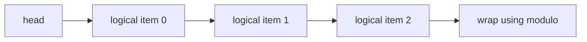

# Dynamic Array

This module provides a generic `void *` container that behaves as both a dynamic array and a circular queue. It is the shared root-stack implementation for the GC collectors and also serves as a general-purpose resizable buffer for the test harness.

## Core Data Model

The structure tracks four pieces of state:

| Field | Meaning |
| --- | --- |
| `head` | Index of the logical first element. |
| `count` | Number of live elements currently stored. |
| `capacity` | Number of slots allocated in the backing store. |
| `data` | Backing storage containing `void *` elements. |

The use of `head` plus `count` makes the container a circular buffer rather than a shifting array. That choice is what allows efficient front removal.

## Public API

| API | Behavior |
| --- | --- |
| `array_init(DynamicArray *array)` | Initializes the structure and allocates the initial storage. |
| `array_get(array, index)` | Reads the logical element at `index`. |
| `array_set(array, index, item)` | Replaces the logical element at `index`. |
| `array_push(array, item)` | Appends to the logical tail. |
| `array_pop(array)` | Removes from the logical tail. |
| `array_enqueue(array, item)` | Queue-style append alias. |
| `array_dequeue(array)` | Removes from the logical head. |
| `array_free(array)` | Releases the backing storage and resets the fields. |

## Complexity Summary

| API | Time Complexity | Notes |
| --- | --- | --- |
| `array_init()` | $O(1)$ | Allocates the initial buffer. |
| `array_get()` | $O(1)$ | Single modulo-based index calculation. |
| `array_set()` | $O(1)$ | Same as get plus assignment. |
| `array_push()` | Amortized $O(1)$ | Rare resize doubles capacity. |
| `array_pop()` | $O(1)$ | Tail removal only changes `count`. |
| `array_enqueue()` | Amortized $O(1)$ | Alias for push. |
| `array_dequeue()` | $O(1)$ | Advances `head` only. |
| `array_free()` | $O(1)$ | Releases the backing buffer. |

## Circular Buffer Mechanics

The physical index is computed with modular arithmetic:

```text
physical_index = (head + logical_index) % capacity
```

This means logical ordering is preserved even when the buffer wraps around the end of the backing array. Front removal is therefore a metadata update, not a memory move.

```txt
Circular buffer view

physical storage: [0][1][2][3][4][5]
logical order:        H  A  B  C

enqueue -> write at tail position
dequeue -> move head forward one slot

actual index = (head + logical_index) % capacity
```

### Why This Is Fast

1. `array_dequeue` only advances `head` and decrements `count`.
2. `array_pop` only decrements `count`.
3. No element shifting occurs on removal.

That keeps both stack-like and queue-like removal at $O(1)$ time.

## Growth Strategy

When the buffer fills, `resize` allocates a new array with double the capacity and copies the logical sequence into contiguous order starting at index zero.

| Property | Effect |
| --- | --- |
| Growth factor of 2 | Lowers the number of reallocations over time. |
| Logical-to-physical copy | Restores a simple contiguous layout after wraparound. |
| Reset `head` to 0 | Simplifies later indexing and queue operations. |

This is the standard amortized-growth tradeoff: occasional linear-copy work buys very cheap steady-state inserts.



## Design Tradeoffs

The container stores generic pointers and does not own the pointed-to objects. That makes it flexible enough to serve as:

1. A GC root stack.
2. A temporary traversal stack for graph marking.
3. A simple test harness buffer.

Ownership remains explicit at the caller level, which is important for a repository focused on memory management discipline.

## Related Documentation

- [Root overview](../README.md)
- [Allocator](../allocator/README.md)