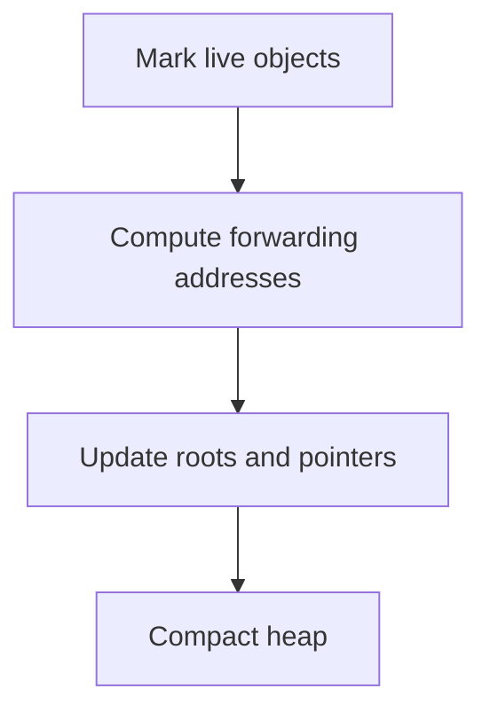
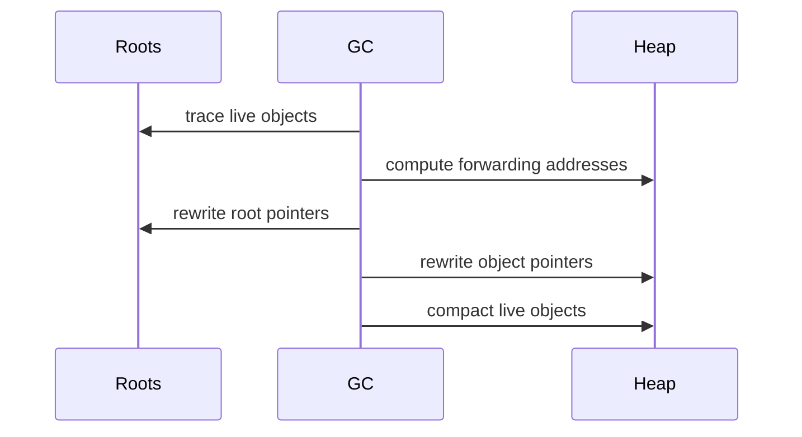

# Mark And Compact

This module implements a tracing collector with compaction. It combines reachability analysis with a moving heap so live objects end up densely packed at the front of the arena.

## VM Layout

The VM state tracks:

| Field             | Purpose                               |
| ----------------- | ------------------------------------- |
| `roots`         | Root stack used for tracing.          |
| `num_objects`   | Live object count.                    |
| `heap_capacity` | Size of the bump-allocated arena.     |
| `heap_start`    | Base address of the arena.            |
| `next_free`     | Bump pointer for the next allocation. |

Unlike mark-sweep, this collector does not allocate each object through the custom free list. Instead, it reserves a contiguous arena and advances `next_free` for each new object. That is classic bump allocation.

## Public API

The interface mirrors the mark-sweep VM:

| API                          | Role                                         |
| ---------------------------- | -------------------------------------------- |
| `newVM()`                  | Initialize the compacting VM and heap arena. |
| `freeVM(vm)`               | Run final collection and release memory.     |
| `pushRoot(vm, obj)`        | Add an object to the root stack.             |
| `popRoot(vm)`              | Remove the most recent root.                 |
| `pushInt(vm, intValue)`    | Create and root an integer object.           |
| `pushChar(vm, charValue)`  | Create and root a char object.               |
| `pushPair(vm, head, tail)` | Create and root a pair object.               |
| `gc(vm)`                   | Run mark-compact collection.                 |

## Complexity Summary

| API / Phase | Time Complexity | Notes |
| --- | --- | --- |
| `newVM()` | $O(1)$ | Allocates VM and heap arena. |
| `freeVM()` | $O(N)$ | Final GC plus cleanup of the arena. |
| `pushRoot()` / `popRoot()` | Amortized $O(1)$ / $O(1)$ | Root stack operations. |
| `pushInt()` / `pushChar()` / `pushPair()` | $O(1)$ when space remains | Bump allocation is constant time. |
| Mark phase | $O(R + N)$ | Traverses roots and live graph. |
| Forwarding address computation | $O(N)$ | One pass over the heap. |
| Pointer update | $O(R + N)$ | Roots plus pair references. |
| Compaction | $O(N)$ | Moves only live objects. |

## Why Bump Allocation Matters

Bump allocation is extremely fast because allocation is just:

```text
object = next_free
next_free += sizeof(Object)
```

There is no free-list search on the hot path. The tradeoff is that reclamation is deferred to GC, which must recover the space in larger batches.

```txt
Bump allocation picture

heap_start                                                        heap_end
    |                                                                 |
    v                                                                 v
    [obj1][obj2][obj3]..................................................>
                     ^
                     next_free

Allocate a new object by writing at next_free and advancing it.
```

```txt
Bump allocator in one glance

heap_start
    |
    v
[obj1][obj2][obj3][free space.........................]
                ^
                next_free

New allocations never search for a hole.
They simply land at next_free and move the pointer forward.
```

## Collection Pipeline

The collector uses four distinct phases.

```txt
Collection pipeline

mark live objects -> compute forwarding addresses -> update roots/pointers -> compact heap
```



### 1. Mark

Roots are traversed iteratively and marked through the low bit of `next`, exactly like the mark-sweep collector.

```txt
Mark-compact marking example

roots: [A] [C]
    |   |
    v   v
heap:  [A] [garbage] [B] [garbage] [C]

marked: [A*] [      ] [B ] [      ] [C*]
```

```txt
Mark step as a reachability picture

roots
  |
  +--> A
  |     |
  |     +--> B
  |           |
  |           +--> C
  |
  +--> E

After marking, only the live chain is tagged with the mark bit.
Unreachable nodes remain unmarked and will be ignored later.
```

### 2. Forwarding Address Computation

For every marked object, the collector computes its new location in the compacted heap and stores that destination in the tagged `next` field. This is the forwarding address.

```txt
Forwarding address map

live A -> heap_start
live B -> heap_start + 1 * sizeof(Object)
live C -> heap_start + 2 * sizeof(Object)

These addresses are stored in the tagged next field before the move.
```

```txt
Forwarding address calculation

Old heap layout:

heap_start
    |
    v
[A*] [garbage] [B*] [garbage] [C*] ................. next_free

Forwarding table:

A -> heap_start
B -> heap_start + sizeof(Object)
C -> heap_start + 2 * sizeof(Object)

The collector stores these destinations in the tagged next field
so every live object knows where it will move.
```

### 3. Pointer Update

Once forwarding information exists, the collector rewrites:

1. Root pointers in the root stack.
2. `head` and `tail` references inside pair objects.

This step is critical because compaction would otherwise invalidate all references to moved objects.

```txt
Pointer update example

Before update:

root ---------> A(old address)
pair.head ---> B(old address)
pair.tail ---> C(old address)

After update:

root ---------> A(new address)
pair.head ---> B(new address)
pair.tail ---> C(new address)

The root stack and the pair graph must both point at the relocated objects.
```



### 4. Heap Compaction

Finally, the collector walks the heap again and `memmove`s live objects to the front of the arena. After the move, `next_free` is reset to the end of the compacted region and `num_objects` reflects the number of surviving objects.

```txt
Compaction result

Before:
| live | garbage | live | garbage | live |

After:
| live | live | live | free space ................................ |
```

```txt
Compaction result as an ASCII memory map

Before compaction:

[A*] [garbage] [B*] [garbage] [C*] [garbage..............]

After compaction:

[A ] [B ] [C ] [free free free free free free free......]

Live objects become contiguous.
All holes disappear.
The allocator sees one larger free region.
```

```txt
Compaction scan

scan heap
   |
   +--> marked? yes -> memmove to compact_ptr -> advance compact_ptr
   +--> marked? no  -> skip garbage
```

## Engineering Strengths

Mark-compact has two high-value properties:

1. It reclaims unreachable memory.
2. It removes fragmentation by packing survivors contiguously.

That makes the heap behavior especially clean for long-running workloads where fragmentation would otherwise degrade allocation quality.

## Engineering Tradeoffs

The price of compaction is relocation complexity. Because objects move, every external and internal pointer must be updated correctly. This module is therefore the best demonstration in the repository of the bookkeeping required for a moving collector.

```txt
Why the extra bookkeeping exists

If objects do not move:
    pointers stay valid
    fragmentation can remain

If objects do move:
    pointers must be rewritten
    fragmentation disappears

Mark-compact chooses the second option.
It pays with pointer updates and gains a denser heap.
```

## Related Documentation

- [Root overview](../README.md)
- [Mark-sweep](../mark_and_sweep/README.md)
