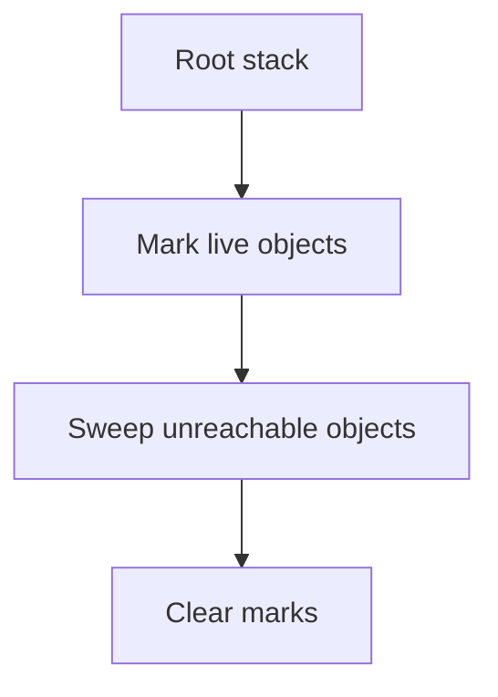
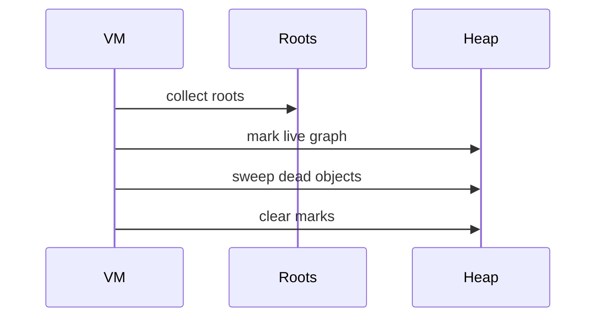

# Mark And Sweep

This module implements a tracing garbage collector that discovers live objects by starting from a root set and then frees everything that is unreachable.

## VM Layout

The VM state contains:

| Field | Purpose |
| --- | --- |
| `first_object` | Head of the allocated object list. |
| `roots` | Dynamic array used as the root stack. |
| `num_objects` | Count of currently allocated objects. |

The object list is singly linked through `next`, and the low bit of `next` is reserved as the mark bit. That is pointer tagging: the collector encodes a GC state bit inside the pointer representation instead of storing a separate boolean field.

## Public API

| API | Role |
| --- | --- |
| `newVM()` | Allocate and initialize the VM. |
| `freeVM(vm)` | Final cleanup and heap release. |
| `pushRoot(vm, obj)` | Protect an object from collection. |
| `popRoot(vm)` | Remove the most recent root. |
| `pushInt(vm, intValue)` | Create and root an integer object. |
| `pushChar(vm, charValue)` | Create and root a char object. |
| `pushPair(vm, head, tail)` | Create and root a pair object. |
| `gc(vm)` | Run mark-sweep collection. |

## Complexity Summary

| API / Phase | Time Complexity | Notes |
| --- | --- | --- |
| `newVM()` | $O(1)$ | Allocates VM and initializes roots. |
| `freeVM()` | $O(N)$ | Walks the object list to free survivors. |
| `pushRoot()` / `popRoot()` | Amortized $O(1)$ / $O(1)$ | Backed by the dynamic array. |
| `pushInt()` / `pushChar()` / `pushPair()` | Amortized $O(1)$ | Allocation plus root protection. |
| Mark phase | $O(R + N)$ | Traverses reachable objects from the roots. |
| Sweep phase | $O(N)$ | Scans every allocated object. |

## Mark Phase

The mark phase begins at the root stack, copies roots into a temporary traversal buffer, and walks object references until every reachable object has been tagged. For pair objects, both `head` and `tail` are pushed for later visitation.

```txt
Mark traversal

root stack -> traversal buffer -> object graph -> set mark bit on reachable nodes
```

Using a temporary dynamic array instead of recursive traversal keeps the implementation iterative and easier to follow. It also keeps the collector’s explicit memory usage visible.

```txt
Mark phase example

roots:  [A] [F]
         |   |
         v   v
heap:   [A] -> [B] -> [C] -> [D] -> [E] -> [F]

after mark:
        [A*] -> [B*] -> [C*] -> [D ] -> [E ] -> [F*]
```

```txt
Visit logic

work stack -> visit object
                 |
                 +--> pair? yes -> push head and tail
                 +--> pair? no  -> stop
```

## Sweep Phase

The sweep phase walks the full object list:

1. If an object is unmarked, it is unreachable and is returned to the allocator.
2. If an object is marked, the tag is cleared so the next GC cycle starts cleanly.
3. The list remains intact for all surviving objects.

This produces a straightforward stop-the-world collector with a simple correctness argument: anything not reached from the roots is reclaimed.



```txt
Sweep phase example

Before sweep:
[A*] -> [B*] -> [C ] -> [D*] -> [E ]

Sweep action:
keep A, keep B, free C, keep D, free E

After sweep:
[A*] -> [B*] -> [D*]
```

```txt
Sweep decision

walk object list
   |
   +--> marked? yes -> unmark for next cycle
   +--> marked? no  -> free object
```

## Threshold Behavior

The implementation triggers collection once `num_objects` reaches the configured threshold. That keeps the collector from waiting until allocation failure and makes collection cadence predictable during demonstration.

## Engineering Tradeoffs

Mark-sweep is attractive because it handles arbitrary graphs, including sharing and cycles, without requiring ownership discipline from the caller. The downside is fragmentation: objects are freed individually, but live objects are not moved, so the heap can become sparse over time.



## Related Documentation

- [Root overview](../README.md)
- [Mark-compact](../mark_and_compact/README.md)