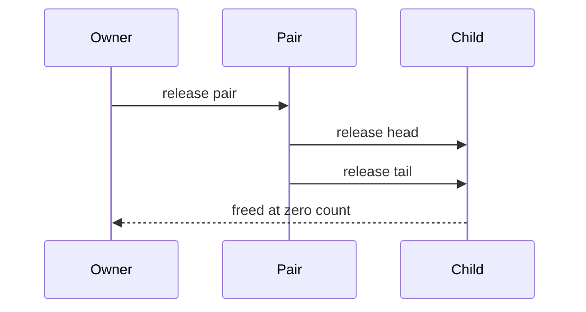

# Reference Counting

This module implements immediate reclamation through reference counting. It is the most direct ownership model in the repository and demonstrates how object lifetime can be driven by deterministic retain and release operations.

## Object Model

Objects are represented by a tagged `ObjectType` plus a payload union.

| Type         | Payload                               |
| ------------ | ------------------------------------- |
| `OBJ_INT`  | `int_value`                         |
| `OBJ_CHAR` | `char_value`                        |
| `OBJ_PAIR` | `head` and `tail` object pointers |

The union keeps the object compact because only one payload form is valid at a time. The `ref_count` field records the number of active owners.

## Public API

| API                                      | Responsibility                               |
| ---------------------------------------- | -------------------------------------------- |
| `pushInt(int value)`                   | Allocate an integer object with refcount 1.  |
| `pushChar(char value)`                 | Allocate a character object with refcount 1. |
| `pushPair(Object *head, Object *tail)` | Allocate a pair and retain both children.    |
| `rc_retain(Object *obj)`               | Increment ownership for a live reference.    |
| `rc_release(Object *obj)`              | Decrement ownership and free at zero.        |

## Complexity Summary

| API | Time Complexity | Notes |
| --- | --- | --- |
| `pushInt()` | $O(1)$ | One allocation and one store. |
| `pushChar()` | $O(1)$ | One allocation and one store. |
| `pushPair()` | $O(1)$ | Allocates one object and retains two children. |
| `rc_retain()` | $O(1)$ | Counter increment. |
| `rc_release()` | $O(1)$ typical, $O(n)$ cascading | May cascade through owned children. |

## Ownership Semantics

The collector is really an ownership protocol:

1. Every new object begins with one owner.
2. Passing ownership to another structure requires a retain.
3. Dropping ownership requires a release.
4. When an object reaches zero owners, it is destroyed immediately.

The pair object is the important case because it owns its children. Releasing a pair recursively releases `head` and `tail`, which creates cascading cleanup along the object graph.

```txt
Reference counting life cycle

create object
     |
     v
  ref_count = 1
     |
 retain() -> ref_count++
     |
 release() -> ref_count--
     |
     +-- if ref_count > 0, keep alive
     |
     +-- if ref_count == 0, free object
```

```txt
Reference-count release flow

release(pair)
    |
    v
ref_count becomes 0
    |
    +--> release(head)
    |
    +--> release(tail)
    |
    v
free pair object
```

```txt
Pair ownership cascade

 [pair]
    /  \
   v    v
[head][tail]

release(pair)
    |
    +--> release(head)
    +--> release(tail)
```

## Engineering Strengths

Reference counting has two practical advantages in this codebase:

1. Objects are reclaimed as soon as the last external reference disappears.
2. The runtime behavior is easy to inspect with a debugger because lifetime transitions are explicit.

That determinism makes it useful as a baseline for comparing the GC implementations.



## Limitations

The implementation does not attempt cycle detection. That is a deliberate design choice for clarity. Cyclic graphs can retain each other indefinitely even if no external owner exists. This is the classic limitation of plain reference counting and a useful contrast with the tracing collectors in the repository.

## Related Documentation

- [Root overview](../README.md)
- [Allocator](../allocator/README.md)
